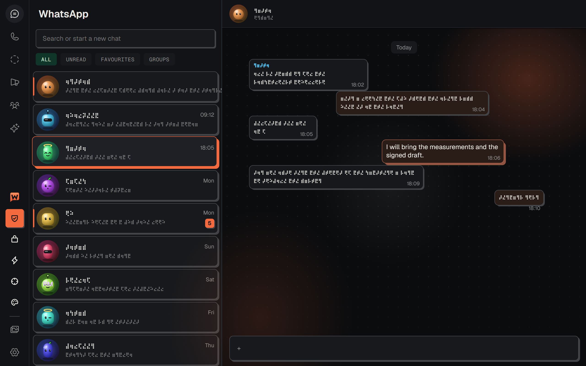
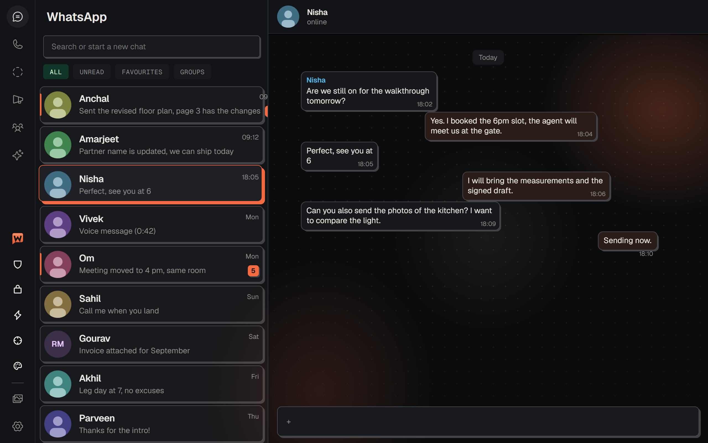
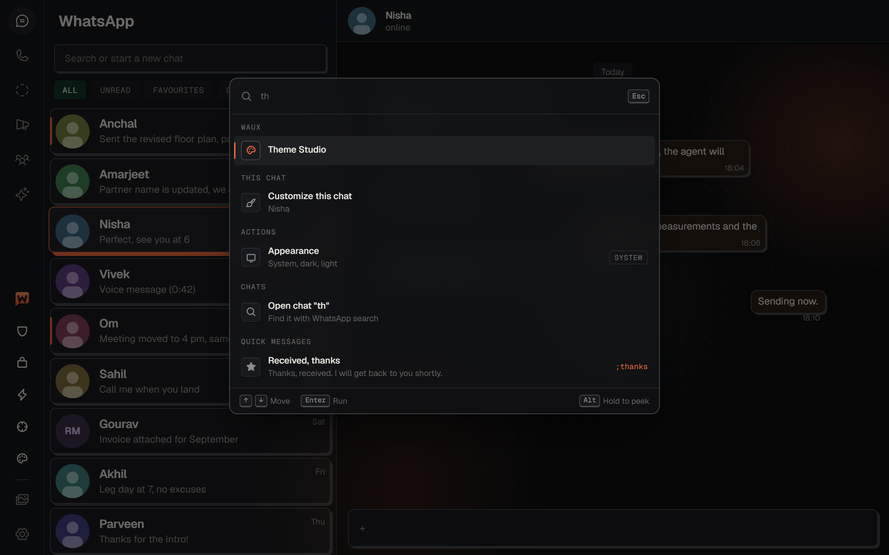
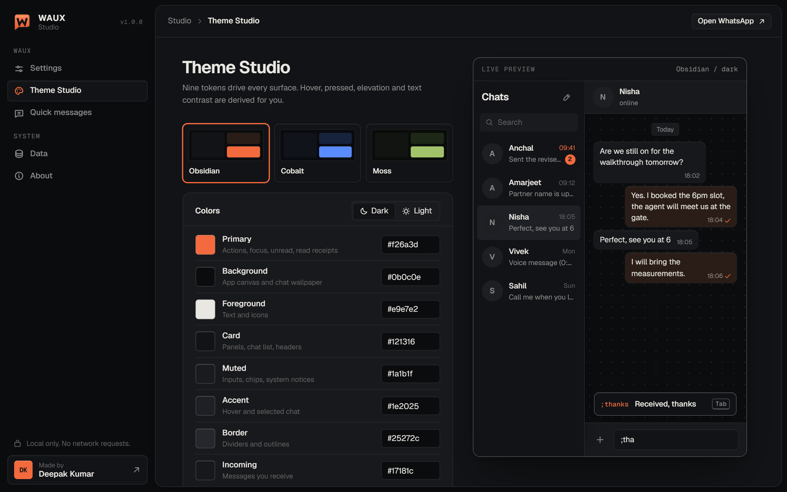
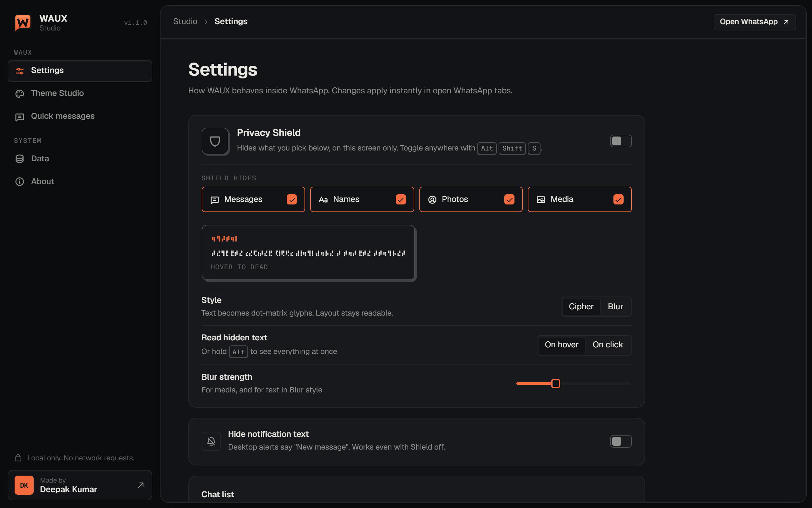
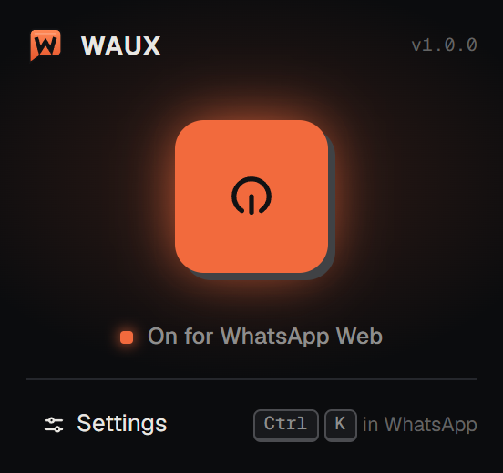

<p align="center">
  
</p>

<h1 align="center">WAUX</h1>

<p align="center">
  <b>WhatsApp Web, redesigned.</b><br>
  A premium theme engine, cipher privacy and quick messages for WhatsApp Web. Everything stays on your device.
</p>

<p align="center">
  <a href="LICENSE"></a>
  
  
  
</p>

<p align="center">
  <a href="https://waux.1619.in"><b>waux.1619.in</b></a>
</p>

<p align="center">
  
</p>

---

## Features

**Design**
- **Obsidian theme.** Graphite surfaces, one ember accent, Geist typography, hairline borders and soft-brutalist depth. Light, dark or follow the system.
- **Theme Studio.** Nine color tokens plus radius, depth, glass blur, density, typeface and wallpaper. Hover, pressed, elevation and text-on-surface colors are derived for you, with a live preview. Import tweakcn / shadcn CSS variables or WAUX JSON.
- **Ambient wallpaper.** Slow, soft light drifting behind your messages instead of the doodle pattern.
- **Chat cards.** Every chat is a card; unread chats get an ember rail, the open chat an ember edge.

**Privacy**
- **Privacy Shield.** One switch (<kbd>Alt</kbd> <kbd>Shift</kbd> <kbd>S</kbd>) that hides what you choose: messages, names, photos, media.
- **Cipher text.** Hidden text is redrawn as dot-matrix glyphs by a bundled font, so layout stays intact and nothing in WhatsApp is modified. Blur is available as an alternative.
- **3D avatars.** Profile photos are replaced by generated 3D characters while the Shield is on.
- **Read on demand.** Hover (or click) a message, chat or header to read it; hold <kbd>Alt</kbd> to see everything.
- **Hidden chats.** Keep chosen chats out of the chat list, in a PIN-protected area. Nothing is archived or deleted.
- **Notification text.** Desktop alerts can say "New message" instead of the content.

**Speed**
- **Command palette.** <kbd>Ctrl</kbd>/<kbd>⌘</kbd> <kbd>K</kbd> for every action, quick message and visible chat.
- **Quick messages.** Type `;shortcut` and press <kbd>Tab</kbd>. WAUX inserts the text and never sends it. Categories, favorites, search, JSON import and export.
- **Focus Mode.** Hide the chat list while you work in one conversation.
- **Declutter.** Hide Status, Channels, Communities, Calls, Meta AI and the "Get WhatsApp for Windows" banner.

## Screenshots

| | |
|---|---|
| <br><sub>Obsidian theme, chat cards and ambient wallpaper</sub> | <br><sub>Command palette: actions, chats and quick messages</sub> |
| <br><sub>Theme Studio with live preview</sub> | <br><sub>Settings: Privacy Shield, chat list, interface, shortcuts</sub> |

<p align="center"><br><sub>Toolbar popup: one key to switch WAUX on or off</sub></p>

## Install

### From a release

1. Download `waux-<version>.zip` from [Releases](https://github.com/KumarDeepak16/waux/releases) and unzip it.
2. Open `chrome://extensions` and switch on **Developer mode**.
3. Click **Load unpacked** and select the unzipped folder.
4. Open <https://web.whatsapp.com>. Tabs that are already open are updated automatically.

Works in Chrome, Edge, Brave, Arc, Opera and other Chromium browsers, version 120 or newer.

### From source

```bash
git clone https://github.com/KumarDeepak16/waux.git
cd waux
npm install
npm run dist      # tests, typecheck, build -> dist/ and release/waux-<version>.zip
```

Then load `dist/` with **Load unpacked**.

## Use

| Where | Keys | Action |
|---|---|---|
| WhatsApp | <kbd>Ctrl</kbd>/<kbd>⌘</kbd> <kbd>K</kbd> | Command palette |
| WhatsApp | `;shortcut` <kbd>Tab</kbd> | Insert a quick message |
| WhatsApp | hold <kbd>Alt</kbd> | Read all hidden text |
| WhatsApp | <kbd>Esc</kbd> | Close WAUX panels |
| Browser | <kbd>Alt</kbd> <kbd>Shift</kbd> <kbd>S</kbd> | Privacy Shield |
| Browser | <kbd>Alt</kbd> <kbd>Shift</kbd> <kbd>F</kbd> | Focus Mode |

The WAUX keys on WhatsApp's left rail open the palette, Privacy Shield, Hidden chats, quick messages, Focus Mode and Theme Studio. The toolbar popup switches WAUX on and off; everything else is in **Settings**. Browser shortcuts can be changed at `chrome://extensions/shortcuts`.

### Quick messages JSON

Import accepts a WAUX export, a plain array, or `{ "templates": [...] }`:

```json
[
  { "title": "Received, thanks", "body": "Thanks, received. I will get back to you shortly.", "shortcut": "thanks", "category": "Work", "favorite": true },
  { "text": "On my way, about 10 minutes out.", "shortcut": "omw" }
]
```

Duplicates are skipped, and a shortcut that is already in use is not overwritten.

## Privacy

WAUX collects nothing and makes no network requests. Settings, theme, quick messages and hidden-chat names live in `chrome.storage.local` on your device. No accounts, analytics or remote code; fonts and artwork are bundled. Read the full [Privacy Policy](PRIVACY.md).

| Permission | Why |
|---|---|
| `storage` | Save your settings locally |
| `scripting` | Attach WAUX to WhatsApp tabs already open at install or update |
| `web.whatsapp.com` | The only site WAUX runs on |

## Troubleshooting

WhatsApp updates its web app often. In the WAUX Studio, **Data, WhatsApp compatibility** shows which page hooks WAUX can find. If something shows *Not found*, press <kbd>Ctrl</kbd> <kbd>K</kbd> in WhatsApp, run **Save layout report** and attach the file to an [issue](https://github.com/KumarDeepak16/waux/issues). The report holds page structure only (element types, roles, test ids, sizes), never messages, names or numbers.

## Development

```bash
npm run dev        # watch build into dist/; reload the extension after changes
npm test           # unit tests: theme engine, importers, quick messages, sidebar math
npm run typecheck
npm run icons      # re-render icons and store tiles from assets/icon.svg
npm run verify     # load dist/ in Chromium and check popup, Studio, WhatsApp and a structural mock
npm run site       # regenerate the landing page assets in docs/ (served at waux.1619.in)
```

```
src/
  adapter/     the only code that knows WhatsApp's DOM: selectors, observers, composer, chat list, markers
  engines/
    theme/     tokens -> derived palette -> WhatsApp WDS variables; presets; import / export
    privacy/   Shield flags and reveal interactions
    quick/     search, ;shortcut matching, JSON import / export
  content/     content script, notification redaction (main world), skin.css
  overlay/     in-page UI in a closed shadow root: palette, dock, hidden chats, start screen
  popup/       toolbar popup
  studio/      Settings, Theme Studio, Quick messages, Data, About
  ui/          design system: tokens, components, icons, logo
scripts/       build, cipher font and avatar generators, icon renderer, verification, site assets
docs/          landing page (GitHub Pages, waux.1619.in)
```

### Releasing

1. Bump `version` in `static/manifest.json` and `package.json`.
2. Commit, then tag and push: `git tag v1.0.1 && git push origin v1.0.1`.
3. The **Release** workflow tests, builds and attaches `waux-<version>.zip` to that GitHub release. The website's Download button always serves the newest release.

**How it survives WhatsApp updates.** WhatsApp styles itself with its own design tokens (`--WDS-*`). WAUX compiles your tokens into a full palette and overrides those variables, so most of the interface follows without touching WhatsApp's markup. Structural styling uses only stable hooks (ids, `data-testid`, ARIA roles, `data-icon`), never hashed class names, and lives in `src/adapter` and `src/content/skin.css`.

Contributions are welcome. See [CONTRIBUTING.md](CONTRIBUTING.md) and report security issues as described in [SECURITY.md](SECURITY.md).

## Disclaimer

WAUX is an independent project. It is not affiliated with, endorsed by, or sponsored by WhatsApp LLC or Meta Platforms, Inc. "WhatsApp" is a trademark of WhatsApp LLC, used here only to describe compatibility.

WAUX changes how WhatsApp Web looks in your own browser. It does not access your account, encryption keys or servers, and never sends messages for you. Privacy Shield, cipher text, hidden chats and the PIN are visual privacy features for your screen, not security controls. Use WAUX in line with WhatsApp's Terms of Service.

## License

[MIT](LICENSE) © Deepak Kumar. Bundled third-party components are listed in [THIRD_PARTY_NOTICES.md](THIRD_PARTY_NOTICES.md).

<p align="center">Made by <a href="https://1619.in">Deepak Kumar</a></p>
